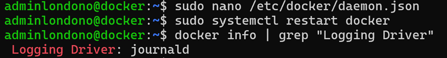

# first_docker_test

## by Alejandro Londoño Bermúdez :)

### Enter the virtual machine (in my case an azure vm)

### Install docker ce and ce-cli in supported version for devicemapper (24.0.9)

### Run Hello World Container

### Review the actual storage driver

### Change storage driver to "devicemapper"

### Run Hello World Container

### Return to overlay2 storage driver

### Create Nginx Container

### Discard and run in background

### Change to Nginx container with specific config

### Review logging driver

### Change logging driver to journald

### Review logs

